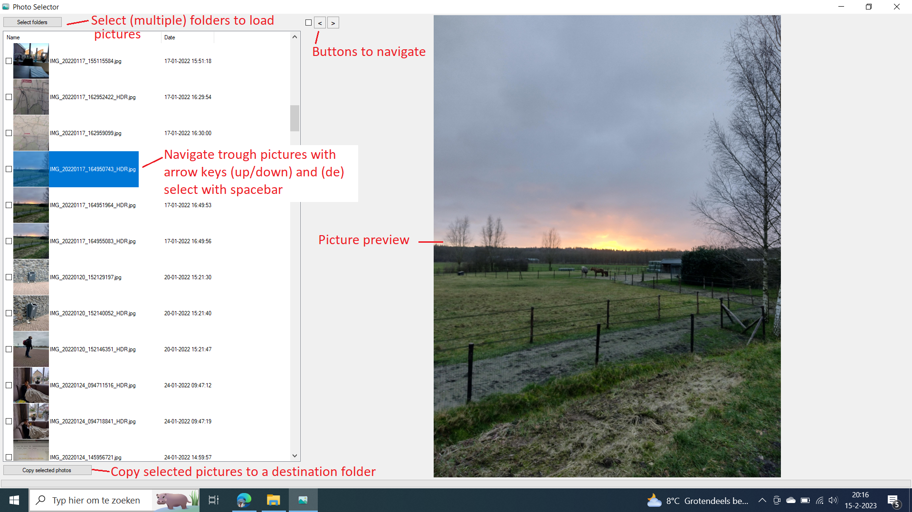

# PhotoSelector
PhotoSelector is a simple application to select multiple pictures from multiple folders, and copy the selection to a destination folder.

# How to use?
Download the [build](https://github.com/GLionD/PhotoSelector/raw/master/PhotoSelector/bin/Release/PhotoSelector.exe) of the application or clone the repository.  
You might see security warnings when you download the executable, these can be ignored.
When you start the application you see this window:

The application has the following functions:
* Load all images from multiple folders
* Images are sorted by attribute 'Date taken'. If this attribute is not available, the save date will be used.
* You can navigate trough the loaded pictures with arrow keys up/down and select the wanted pictures with spacebar. You can also use the buttons at the top for navigation.
* When your selection is ready, you can copy the pictures to a destination folder. 

The application is developed for own purposes and can be used freely. Use is at own risk.
